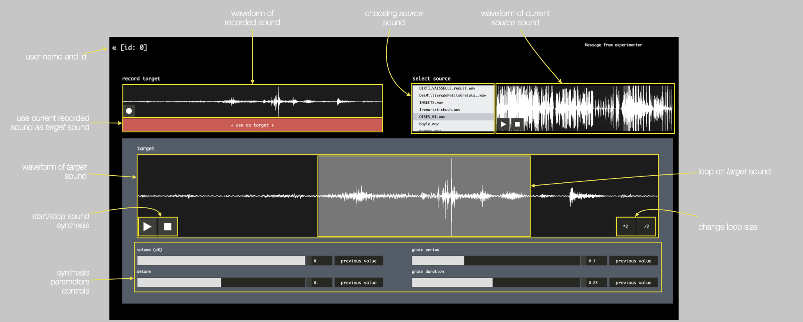
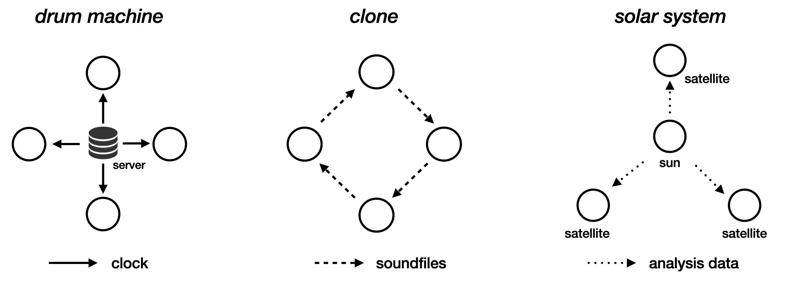

# _Simone_

_Simone_ is a set of web interfaces for collective (local-)networked improvisation.

_Simone_ is a distributed instrument based on 2 concepts : using the microphone in the sound synthesis process, using the network to share information between users.

_Simone_ was developped using the [*soundworks*](https://github.com/collective-soundworks/soundworks/) framework.


## Installation

Install `Node.js` (LTS version)

Clone the repo or download it to the location you want on your computer then in the terminal: 

```
cd /path/to/simone
npm install
npm run build
```

## Starting the server

```
npm run start
```

This should start the server and prints several IP adresses like this: 

```
+ https server listening on
    https://127.0.0.1:8000
    https://XXX.XXX.XXX.XXX:8000
```

## Accessing a client

To access a client open your favorite web browser on your device (preferably Firefox or Chrome, latest version).

Then, provided that you are on the same network than the server, go to the address written in the terminal (the first one will only work on the device that started the server).

You'll have to give access to the microphone.

## Putting sound in the soundbank

You will need to put soundfiles in the `simone/soundbank/` folder to be used by the application. Do not put them in any subfolders.

_Simone_ only support `wav` and `mp3` formats.

## How it works 

The web client provides you with a interface that controls a sound synthesis process based on audio inputs from your microphone. 
The sound you record is then transformed through a process of 'audio mosaicking'.

Audio mosaicking refers to the process of recomposing the temporal evolution of a given target audio file from segments cut out of source audio materials. (cf. http://recherche.ircam.fr/equipes/temps-reel/audio-mosaicking/).

To go into more details, your input (called the _target_ sound) is cut into small segments and for each of these segments we look for the 'most similar' segment in another sound (the _source_ sound).
The resulting sound then sound like the _target_ sound but reconstructed from patches from the _source_ sound.


By default the interface should look like this.



In the top left is the section for recording a sound with your microphone. Once you stop recording, the waveform will appear. You can then press the red button below to use the sound you just recorded as the _target_ sound for synthesis.

In the top right is a section for selecting a _source_ sound from the `soundbank` folder. Once loaded, the waveform will appear and you will be able to play the selected sound.

The main section shows the waveform of the current _target_ sound as well as various controls.

A loop section is shown on the waveform. The synthesizer will only loop over this section of the _target_ sound. You can move it and change its size using the buttons in the bottom right corner of the waveform.

In this version of the interface, the loop section is constrained by a rythmic grid but other versions (see next section), you can freely define the loop by clicking and dragging over the waveform with the mouse. 

Beneath the waveform are various sliders for controlling the sound synthesis. You can also click on the number boxes to input any desired value.

- __volume__ : Changes volume, from -60 dB to 0 dB.
- __detune__ : Changes the pitch of the sound on a linear scale from -24 (two octaves down) to +24 (two octave up).
- __grain period__ : Changes the time between which two grains of sound are played. Lower value will result in a more "dense" sound.
- __grain duration__ : Changes the duration of each grain played.

## Variations 

_Simone_ offers various improvisation scenarii that differ in the type of information shared by users and the role they assume.

You can select which variation will start by changing the `system` line in the file `simone/config/application.json`.

Available variations : `drum-machine`, `clone`, `solar-system`.



### Drum machine
In this variation, users all share a synchronized clock and rythmic grid to form a collective drum machine. The loop section lengths are constrained to fit on a common grid.

### Clone
In this variation, users start by recording a sound with their microphone. This sound is then sent to another user to be used as their _source_ sound, instead of using the soundbank. Each user must then learn to play with the voice of another user.

!! You will absolutely need to set the number of players in the `simone/config/application.json` file or you won't be able to proceed to the playing interface after each player has recorded a sound.

### Solar system
In this variation, users are put in an asymetric configuration. 

One of them must assume a central role and is called the _sun_. The others are called _satellites_.

To access the _sun_ interface, you will need to go to the following adress : `https://XXX.XXX.XXX.XXX:8000/#omega`.

The _sun_ can record a _target_ sound with the microphone. The data from this _target_ sound is then simultaneously sent to all the _satellites_ to control their sound synthesis. Each _satellite_ can choose its own _source_ sound as well as use the various control sliders. 

Hence, the same _target_ sound is simultaneously resynthesized with a different _source_ sound by each _satellite_. 


## License

BSD-3-Clause
